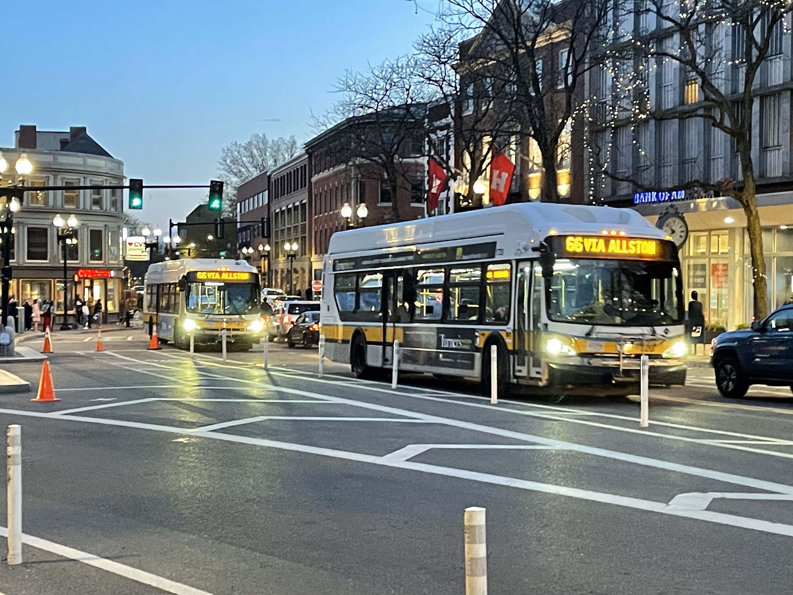
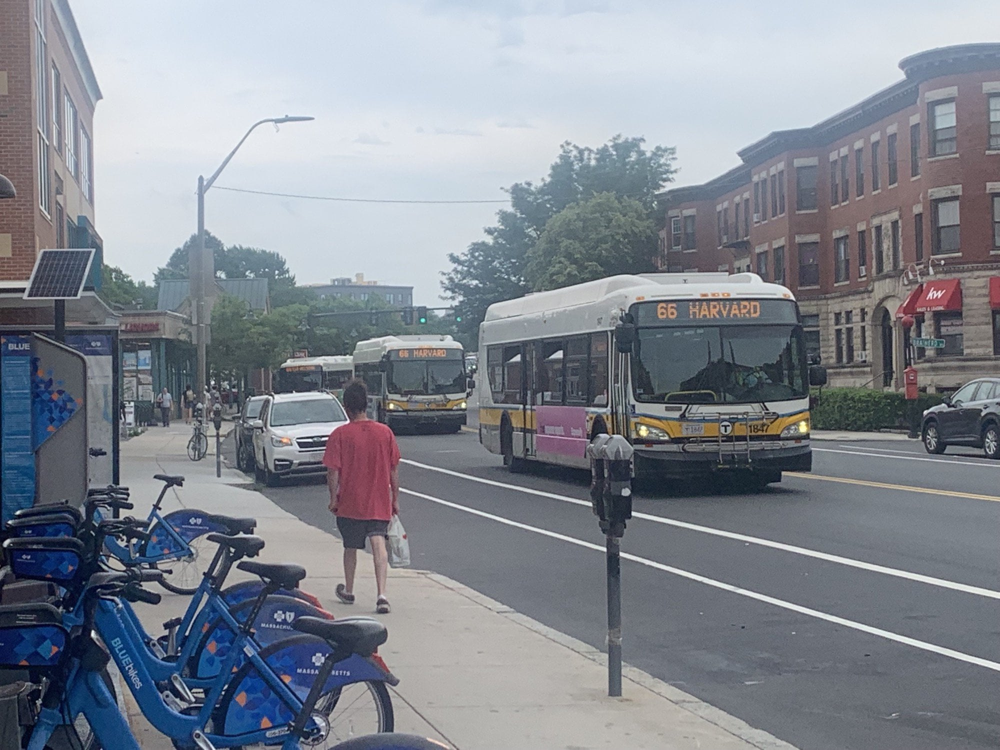
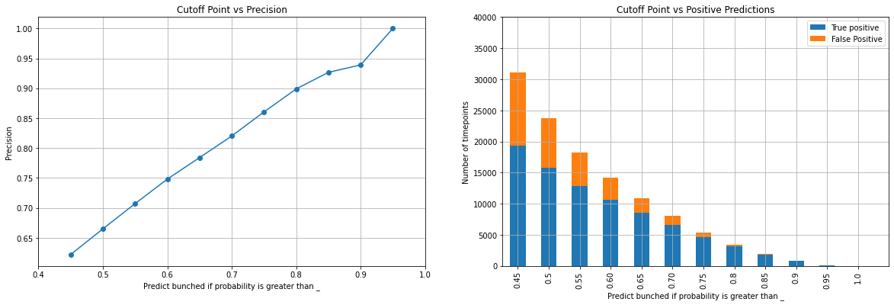

# MBTA bus bunching prediction

This project is aimed at determining when the same bus routes going in the same direction arrives at the same stop within a short period of time. This is also known as bus bunching. Bus bunching can cause a lot of frustration for riders as it could longer wait times and longer transit times. If we can predict when this phenomenon happens, we can more strategically schedule buses to increase the efficiency of the transit system.

The data used in this project is from here. This data only has certain time points, i.e. not every bus stop. The data contains 20+ million lines of data of every MBTA bus at every time point in 2023.

The data was then cleaned and processed. The times between arrivals of the same bus route at the same stop are then calculated. Times between stops were also calculated. I also incorporated various lags of the time data.

I considered a bus to be "bunched" at a time point if the bus arrives within 60 seconds of the previous bus of the same route. After exploring the data, I decided that a logistic regression and a gradient boosting model would be the best options to predict bus bunching.

Since this is an imbalanced classification, I used PR-AUC to evaluate the performance of the models. After some hyperparameter tuning, I arrived at a gradient boosting model with a PR-AUC score of 0.5242 on the test set.

The results of the final model are in the charts below. When using the model, getting a high precision should be emphasized. One way of handling bus bunching is to slow certain buses down. Since we don't want to slow down many buses that don't need to be slowed down, we want to only slow down buses we think have a high probability of bunching. Plus, there's probably limited resources to act on all of the time points predicted to have bunched buses.

For example, if we can afford to act upon 0.2% of all time points, which is about 5000 time points within the 2 months in the test set, then we would only consider a time point to be bunched if the predicted probability is greater than about 0.8. This will give us a precision of about 90%, meaning out of the time points predicted to be bunched, about 90% of them are actually bunched.
